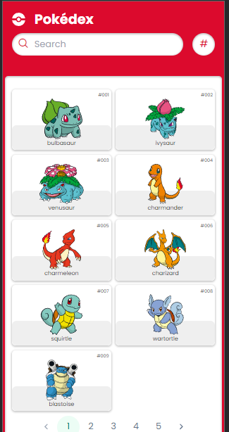
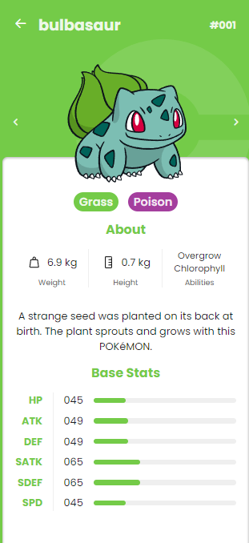

<div align="center">
  <a href="https://vuejs.org/" target="_blank">
    
  </a>

  <a href="https://www.typescriptlang.org/" target="_blank">
      
  </a>
</div>

# POKEDEX

Este projeto é uma aplicação chamada Pokedex, desenvolvida para listar e exibir informações sobre diferentes Pokémon, oferecendo uma interface simples e intuitiva para visualização e busca de detalhes.

## 🚀 Sobre o Projeto

A Pokedex foi criada com o objetivo de simular a famosa enciclopédia digital do universo Pokémon, onde os usuários podem navegar e obter detalhes sobre os Pokémon, como nome, tipo, habilidades e outros dados relevantes.

## 🎯 Funcionalidades

- Listagem de Pokémon com dados básicos (imagem, nome e número).
- Sistema de busca para encontrar Pokémon por nome e número.
- Exibição detalhada de informações ao selecionar um Pokémon.
- Design responsivo, permitindo uma boa experiência em diferentes dispositivos.

## 🛠 Tecnologias Utilizadas

### Frontend

- **Vue 3**
- **Vite**
- **TypeScript**
- **TailwindCSS**
- **PrimeVue**

## 🔧 Configuração do Ambiente

### Pré-requisitos

Antes de começar, certifique-se de ter os seguintes softwares instalados:

1. **NPM**: O gerenciador de pacotes do Node.js.

   ```sh
   npm install npm@latest -g
   ```

## 📦 Instalação

Siga os passos abaixo para configurar o ambiente de desenvolvimento local:

### Frontend

1. Navegue até o diretório do frontend

```sh
git clone https://github.com/Ryan-Costa/pokedex-test-baseworks
cd pokedex-test-baseworks
```

2. Instale os pacotes NPM

```sh
npm install
```

3. Inicie o servidor de desenvolvimento

```sh
npm run dev
```

🖼️ Demo

### Homepage



### Pokemon Details


